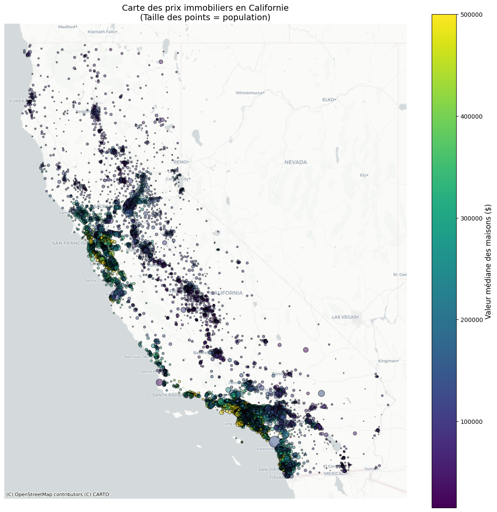
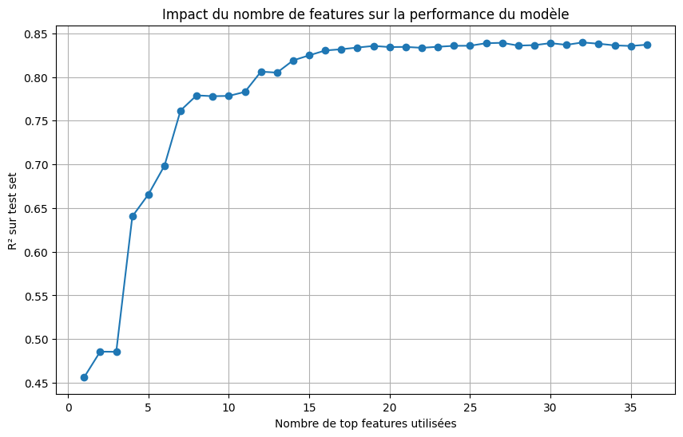

# California Housing — régression et enrichissement géographique


[](https://juleescourne.github.io/portfolio-data-analyst/#/housing)
[](LICENSE)

Régression sur le prix médian des logements californiens, centrée sur
l'**enrichissement géographique** : distances de Haversine, score d'attractivité
gravitaire multi-villes, et mesure du compromis entre nombre de variables et
performance.

**▶ [Essayer la démo](https://juleescourne.github.io/portfolio-data-analyst/#/housing)** —
carte de scénarios, le modèle s'exécute dans votre navigateur.

> Projet issu de mon portfolio Data — [juleescourne.github.io/portfolio-data-analyst](https://juleescourne.github.io/portfolio-data-analyst/)



---

## Ce qui distingue ce projet du tutoriel dont il part

Le jeu California Housing est l'un des plus utilisés en cours de machine learning.
Reproduire le tutoriel ne démontre rien. Le travail porte donc sur la
**géographie**.

### Distance de Haversine, pas euclidienne

Une distance euclidienne sur latitude/longitude serait fausse : à la latitude de la
Californie, un degré de longitude vaut environ 0,79 degré de latitude en kilomètres.
Le projet calcule la distance orthodromique à chaque grande ville.

### Score d'attractivité gravitaire

```text
G = Σ ( population_ville / distance^α )
```

Une simple distance à Los Angeles ignore qu'un district peut être proche de
plusieurs villes moyennes. Le score gravitaire — emprunté aux modèles d'interaction
spatiale — agrège l'influence de toutes les villes : une métropole lointaine et une
ville moyenne proche produisent des scores comparables, ce qui correspond mieux à la
réalité économique.

---

## Résultats

| Métrique | Valeur |
| --- | ---: |
| R² validation croisée (5 plis) | 0,8317 |
| R² holdout | 0,8338 |
| RMSE holdout | ≈ 40 273 $ |
| Variables retenues | 15 sur ~37 |

**Le chiffre à regarder n'est pas le R², c'est l'écart de 0,002** entre validation
croisée et holdout : le modèle généralise, il n'a pas surappris sa partition
d'entraînement.



La courbe s'aplatit vers 15–20 variables : au-delà, chaque variable supplémentaire
n'apporte plus rien de mesurable. C'est ce qui justifie le modèle réduit — plus
compact, plus rapide, plus interprétable, à performance équivalente.

---

## Ce que le projet démontre

| Domaine | Éléments concrets |
| --- | --- |
| Feature engineering | Haversine, score gravitaire, ratios structurels, interactions, transformations logarithmiques |
| Validation | validation croisée 5 plis et `RandomizedSearchCV` **versionnée**, ajustées sur le train uniquement |
| Analyse | mesure explicite du compromis nombre de variables / performance |
| Traitement des données | plafond artificiel identifié et retiré, avec ses conséquences documentées |
| Honnêteté | le biais de sélection restant est décrit, pas dissimulé |

C'est le seul projet ML de mon portfolio où la **recherche d'hyperparamètres est
versionnée** : la grille et la procédure figurent dans le notebook, pas seulement
leur résultat.

---

## Trois limites à connaître avant de lire les chiffres

**Les données datent de 1990.** Ce modèle ne vaut rien pour une estimation actuelle.

**Le R² n'est pas comparable aux benchmarks publics.** La cible d'origine est
écrêtée à 500 001 $ ; ces lignes ont été retirées, ce qui réduit la variance de la
cible et modifie mécaniquement le R².

**La sélection de variables est biaisée.** Le classement d'importance qui sélectionne
les 15 variables est calculé sur le jeu complet, test compris. Le R² annoncé est
donc optimiste. La correction — sélection à l'intérieur de la boucle de validation
croisée — est décrite dans
[ARCHITECTURE.md](ARCHITECTURE.md#5-le-biais-de-sélection-et-pourquoi-il-compte).

À quoi s'ajoute, propre aux données géographiques : le découpage est **aléatoire,
pas spatial**. Deux districts voisins se retrouvent de part et d'autre du découpage
et se ressemblent, ce qui gonfle la performance apparente.

---

## Démarrage rapide

```bash
git clone https://github.com/juleescourne/california-housing-price-prediction.git
cd california-housing-price-prediction
python -m venv .venv && source .venv/bin/activate
pip install -r requirements.txt
```

Téléchargez le [jeu de données Kaggle](https://www.kaggle.com/datasets/camnugent/california-housing-prices)
vers `data/raw/housing.csv`, puis exécutez les trois notebooks dans l'ordre.

Détail et dépannage GeoPandas : [INSTALLATION.md](INSTALLATION.md).

---

## Documentation

| Document | Contenu |
| --- | --- |
| [INSTALLATION.md](INSTALLATION.md) | installation, jeu de données, GeoPandas sous Windows, dépannage |
| [UTILISATION.md](UTILISATION.md) | rôle de chaque notebook, lecture des métriques, limites d'usage |
| [ARCHITECTURE.md](ARCHITECTURE.md) | enrichissement géographique, validation, biais de sélection |

---

## Stack

`Python 3.11+` · `pandas` · `NumPy` · `scikit-learn` · `XGBoost` · `GeoPandas`
· `Contextily` · `Matplotlib` · `Seaborn` · `Jupyter`

---

## Structure

```text
notebooks/    01 exploration · 02 feature engineering · 03 modélisation
assets/       figures utilisées dans la documentation
data/         jeu source et intermédiaires (exclus de Git)
models/       modèle, variables et métriques (exclus de Git)
```

---

## Licence

[MIT](LICENSE) — Jules Courné. Le jeu de données Kaggle n'est pas couvert par cette
licence et n'est pas redistribué.
